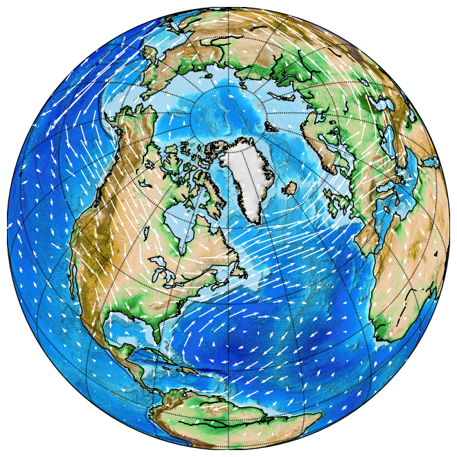

# Marrying Causal Representation Learning with Dynamical Systems for Science

[OpenReview](https://openreview.net/forum?id=MWHRxKz4mq) |
[arXiv](https://arxiv.org/abs/2405.13888) |
[BibTeX](#bibtex)

<p align="center">
    
</p>

Official code for the NeurIPS 2024 paper [Marrying Causal Representation Learning with Dynamical Systems for Science](https://arxiv.org/abs/2405.13888).
This work was performed by [Dingling Yao](https://ddcoan.github.io), [Caroline Muller](https://scholar.google.fr/citations?user=o9VDVDgAAAAJ&hl=fr) and [Francesco Locatello](https://www.francescolocatello.com/).
Please [cite us](#bibtex) when making use of our code or ideas.

## Data Preparation
### Wind Simulation Data
- The wind simulation data is available at `$PROJECT/marrying/DATA/SpeedyWeather`, generated using [SpeedyWeather](https://github.com/SpeedyWeather/SpeedyWeather.jl).

### Sea Surface Temperature Data (SST-V2)
- The SST-V2 dataset is available at: https://psl.noaa.gov/repository/entry/show?entryid=12159560-ab82-48a1-b3e4-88ace20475cd. Please download and store it under `$PROJECT/marrying/DATA/sst`.

## Installation
<p align="left">
    <a href="https://www.python.org/downloads/"></a>
    <a href="https://docs.julialang.org/en/v1/"></a>
    <a href="https://pytorch.org/get-started/"></a>
    <a href="https://black.readthedocs.io/en/stable/"></a>
    <a href="https://mamba.readthedocs.io/en/latest/"></a>
</p>


```shell
cd $PROJECT
mamba env create -f environment.yml -n applied_crl
mamba activate applied_crl
pre-commit install
```

Install the `mechnistic solver` (Pervez et al. 2024) as an editable package
```shell
pip install -e .
```

### Theory Validation with Known Systems:
```shell
# cartpole
python marrying/scripts/cart_pole.py

# ODEBench
python marrying/scripts/ode_bench.py
```


### Wind Simulation Experiment:
```shell
# train
python marrying/src/train.py experiment=train_speedy

# eval
python marrying/src/eval.py experiment=eval_speedy
```

### Sea Surface Temperature Experiment:
```shell
# train
python marrying/src/train.py experiment=train_sst

# eval
python marrying/src/eval.py experiment=eval_sst
```

### Resources and Acknowledgements

#### Wind simulation data
The data generation uses
[SpeedyWeather.jl](https://github.com/SpeedyWeather/SpeedyWeather.jl/tree/main) under the MIT license.


#### Ada-GVAE
This code is a self-implemented pytorch version of the original paper (Locatello et al. 2020). Code was published by the authors at https://github.com/google-research/disentanglement_lib under the Apache License.

### TI-MNN
Code published by Pervez et al. 2024 at https://github.com/alpz/mech-nn.

#### Contrastive identifier
Code published by Yao et al. 2024 at https://github.com/CausalLearningAI/multiview-crl under the MIT license.


#### Mechnistic identifier
This code implementation is built upon [Pervez et al. 2024](https://github.com/alpz/mech-nn)
and [Yao et al. 2024](https://github.com/CausalLearningAI/multiview-crl).


## BibTex

```bibtex
@inproceedings{
yao2024marrying,
title={Marrying Causal Representation Learning with Dynamical Systems for Science},
author={Yao, Dingling and Muller, Caroline and Locatello, Francesco},
booktitle={The Thirty-eighth Annual Conference on Neural Information Processing Systems},
year={2024},
url={https://openreview.net/forum?id=MWHRxKz4mq}
}
```
